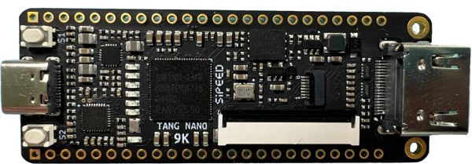
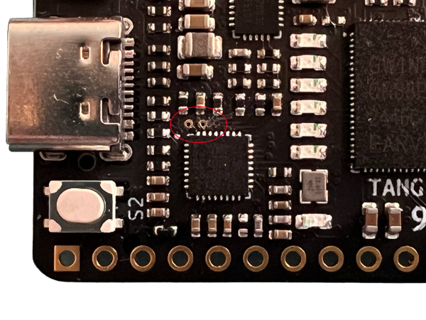

# Description

**Debugger_for_TANG_NANO-9K** is an opensource project that implement a JTAG+UART debugger for SiPEED TANG NANO 9K board with BL702C-A0.

[BL702](https://en.bouffalolab.com/product/?type=detail&id=8) is highly integrated BLE and Zigbee combo chipset for IoT applications, contains **32-bit RISC-V** CPU with FPU, frequency up to **144MHz**, with **132KB RAM** and **192 KB ROM**, 1Kb eFuse, **512KB embedded Flash**, USB2.0 FS device interface, and many other features.

The firmware emulate an [FT2232D](https://ftdichip.com/products/ft2232d/) device, defaultly implement an JTAG+UART debugger, and can be implement as a Dual-Serial Port debugger, a bluetooth debugger, etc.

# Hardware
## Tang Nano 9K

The Tang Nano 9K, powered by [Gowin's](https://www.gowinsemi.com/en/) GW1NR-9 FPGA chip, is a versatile and feature-rich development board. It features several often used connectors, including HDMI, RGB screen, and SPI screen interfaces, as well as a 32Mbit SPI flash and six LEDs. It has 8640 LUT4 logic units, an onboard 27MHz clock and 2 PLLs meaning, as well as basic FPGA designs, it can also be used for full risc-v softcores such as PicoRV.



Schematic: [Tang_nano_9K_3674_schematics.pdf](hardware/Tang_nano_9K_3674_schematics.pdf)


# Firmware
## build firmware

To build usb2uartjtag firmware:

~~~
cd firmware/bl_mcu_sdk
make clean
make BOARD=bl702_debugger APP_DIR=../app APP=usb2uartjtag
~~~

The firmware is './out/app/usb2uartjtag/usb2uartjtag_bl702.bin'.

To build usb2dualuart firmware:

~~~
cd firmware/bl_mcu_sdk
make clean
make BOARD=bl702_debugger APP_DIR=../app APP=usb2dualuart
~~~
The firmware is './out/app/usb2dualuart/usb2dualuart_bl702.bin'.

## flash firmware

Connect the two test points marked with a red oval in the photo below.



Then plug usb cable to PC USB port, and you will see "CDC Virtual ComPort" in device manager, remember the com number.

The flash tool is in tools/bflb_flash_tool directory, and input the command (replace port number and firmware name):

Windows:
~~~
.\bflb_mcu_tool.exe --chipname=bl702 --port=COM9 --xtal=32M --firmware="<path to firmware.bin>"
~~~

Linux:
~~~
./bflb_mcu_tool --chipname=bl702 --port=/dev/ttyACM0 --xtal=32M --firmware="<path to firmware.bin>"
~~~

The output looks like:
~~~
tools\bflb_flash_tool> .\bflb_mcu_tool.exe --chipname=bl702 --port=COM9 --xtal=32M --firmware="main.bin"
[22:07:28.296] - ==================================================
[22:07:28.296] - Chip name is bl702
[22:07:28.297] - Serial port is COM9
[22:07:28.299] - Baudrate is 115200
[22:07:28.299] - Firmware is main.bin
[22:07:28.300] - Default flash clock is 72M
[22:07:28.300] - Default pll clock is 144M
[22:07:28.311] - ==================================================
[22:07:28.483] - Update flash cfg finished
[22:07:28.500] - EFUSE_CFG
[22:07:28.500] - BOOTHEADER_CFG
......
[22:07:31.274] - Load 53856/53856 {"progress":100}
[22:07:31.274] - Write check
[22:07:31.274] - Flash load time cost(ms): 267.942626953125
[22:07:31.275] - Finished
[22:07:31.276] - Sha caled by host: 825d198270c2cf509acda8f8e0830751c532da802060c324a4479e1fe599ae1f
[22:07:31.276] - xip mode Verify
[22:07:31.288] - Read Sha256/53856
[22:07:31.288] - Flash xip readsha time cost(ms): 12.508056640625
[22:07:31.288] - Finished
[22:07:31.288] - Sha caled by dev: 825d198270c2cf509acda8f8e0830751c532da802060c324a4479e1fe599ae1f
[22:07:31.288] - Verify success
[22:07:31.289] - Program Finished
[22:07:31.289] - All time cost(ms): 2220.2548828125
[22:07:31.390] - [All Success]
~~~


## usb2uartjtag (default)

Support JTAG+UART function

UART support baudrate below 2Mbps, and 3Mbps, and some experimental baudrate (stability is not guaranteed):

~~~
12M, 9.6M, 8M, 6.4M, 6M, 4.8M, 4M, 3.2M
we remap baudrate in 10000~12000 to (baud-10000)*10000
for example, 11200bps -> 12Mbps
~~~

LED for process indication.

JTAG function is verified for :

- Gowin FPGA GW1NR-9.


# Project Structure

```
Debugger_for_TANG_NANO-9K
├── firmware
│   ├── app
│   │   ├── usb2dualuart
│   │   └── usb2uartjtag
│   └── bl_mcu_sdk
├── hardware
├── README.md
└── res
```
BL SDK usage tutorial refer to https://dev.bouffalolab.com/media/doc/sdk/bl_mcu_sdk_en/index.html

### Code Explanation
~~~
firmware/app/usb2uartjtag:
├── main.c
├── uart_interface.c
├── jtag_process.c
├── io_cfg.h         //main io cfg, another file is pinmux_config.h in bsp/board/
│                      bl702_debugger
└── usbd_ftdi.c      //all FTDI vendor request process, like baudrate set, dtr/rts set, Latency_Timer
~~~

